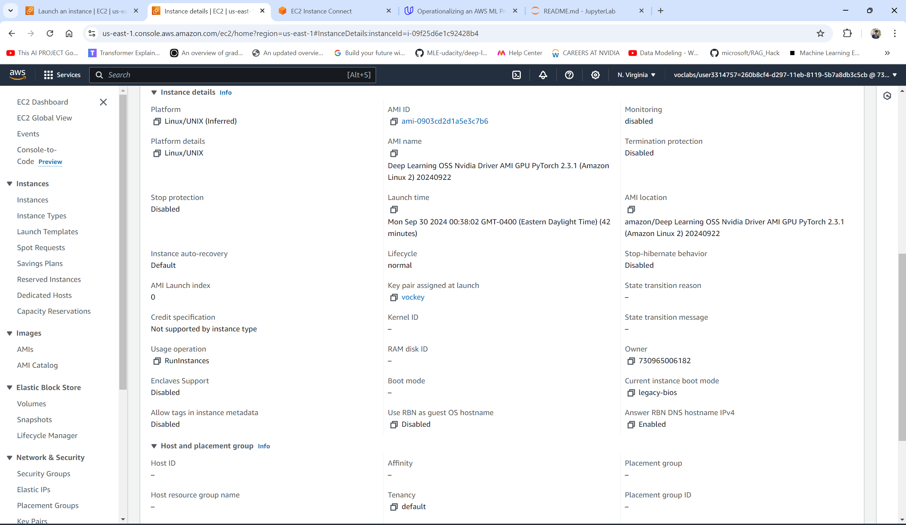

# Udacity Project 4: Operationalizing-an-AWS-ML-Project

## Dog Image Classification

In this project, I completed the following steps:

1. Train and deploy a model on Sagemaker, using the most appropriate instances. Set up multi-instance training in your Sagemaker notebook.
2. Adjust your Sagemaker notebooks to perform training and deployment on EC2.
3. Set up a Lambda function for your deployed model. Set up auto-scaling for your deployed endpoint as well as concurrency for your Lambda function.
4. Ensure that the security on your ML pipeline is set up properly.

### Step 1: Training and deployment on Sagemaker

- **Created SageMaker notebook instance**
I have opted for ml.t3.medium as it provides sufficient capacity to run the notebook. It is also one of the fast startup options provided by AWS that starts under 2 minutes.

SageMaker Notebook Instance:


- **S3 bucket**


- **Deployment**


### Step 2: EC2 Training

A Model can also be trained on an EC2 instance with appropriate dependencies installed. I chose the m5.xlarge instance as it good cost to performance ratio. I chose 45 GBs of EB5 storage as the data and the model, both would be stored on the EC2 instance and not in the S3 storage. The instance has the Deep Learning OSS Nvidia Driver AMI GPU PyTorch 2.3.1 (Amazon Linux 2) AMI. I used the AMI provided pyTorch environment to train the model.




The image above displays the EC2 instance along that completed executing the **ec2train1.py** script for training the model, and the model is saved in the TrainedModels directory.

Differences in training with EC2 and SageMaker:

- The hyperparameters and the model training code can be written and used modularly. The SageMaker instance would spin up other instance simply for a job and every time it needs data it downloads it from S3. There is also overheads of resource provisioning time.

- On the other hand, if the EC2 instance goes down, the data and the model and everything is lost and would not be easily recovered. If some other module / functionality needs the same data, it needs to transfer it to them (in the case that S3 is not used) and it would affect the network and processing performance of the ec2 instance. The trained model needs to be transfered to S3 explicitly to save it.

### Step 3: Step 3: Lambda Function Setup

Once the model is trained and deployed, setting up a Lambda function becomes an important next step. Lambda functions play a vital role in enabling access to your model and its inferences by APIs and other programs, making it a crucial step in the production deployment process.

### Step 4: Lambda security setup and testing

- **Adding SageMaker permission to Lambda Functions**

Lambda function is going to invoke deployed endpoint. However, the lambda function will only be able to invoke endpoint if it has the proper security policies attached to it. The supplied lambda function [`lamdafunction.py`](lamdafunction.py) invokes the deployed endpoint that we created in previous steps `endpoint_Name='pytorch-inference-2024-09-30-03-48-45-555'`  

The function only accepts image URL passed as a request dictionary with content type `application/json`. The request dictionary has the format `{'url':'http://website.com/image-url.extension_short'}`

It invokes the endpoint, passing the request dictionary (`{'url': 'http://....'}`) in the body and setting the content type to `application/json`. The endpoint returns the predictions to the lambda function and the lambda function returns the predictions to the user in the body of the response, with a status code 200.

Two security policy has been attached to the role :

1. Basic Lambda Function Execution
2. my_custom_aws_Invoke_endpoint_policy (custom created policy that provides access only to the deployed endpoint for better security)
3. AmazonSageMakerFullAccess (only used because the submission criteria asks for it. Otherwise, with the custom policy, the system works flawlessly.)

NOTE: AmazonSageMakerFullAccess is only used because the submission criteria asks for it. Otherwise, with the custom policy, the system works flawlessly.


**Vulnerability Assesment**

- Granting 'Full Access' can resolve the authentication error, but it also exposes the system to security risks from malicious actors. Therefore, it's advisable to adhere to the principle of least privilege by granting only the minimum permissions necessary for the task at hand.
- Roles that are old and inactive pose a potential risk to the security of Lambda functions. Therefore, it's essential to delete these roles to mitigate any potential security threats.
- Roles that have policies that are no longer in use can potentially result in unauthorized access, which is a security risk. Hence, it's recommended to remove such policies to mitigate the risk of unauthorized access.

- **Testing Lambda Function**


- **Lambda function Response**

```
Test Event Name
test2

Response
{
  "statusCode": 200,
  "headers": {
    "Content-Type": "text/plain",
    "Access-Control-Allow-Origin": "*"
  },
  "type-result": "<class 'str'>",
  "COntent-Type-In": "<__main__.LambdaContext object at 0x7f838766b550>",
  "body": "[[-7.240581512451172, -3.9522037506103516, -6.469789981842041, -6.674515247344971, -8.029889106750488, -5.801924705505371, -4.720825672149658, -5.159024238586426, -10.867853164672852, -4.211061477661133, -5.178633689880371, -3.7576112747192383, -5.553032398223877, -3.577677011489868, -8.767754554748535, -5.374748706817627, -5.233358383178711, -4.234259605407715, -8.054546356201172, -1.2506968975067139, -9.642879486083984, -4.352718353271484, -6.363508701324463, -7.314257621765137, -5.134388446807861, -11.521886825561523, -4.669672966003418, -6.078031539916992, -6.856049060821533, -5.005102157592773, -4.764231204986572, -7.277270793914795, -10.816815376281738, -7.711432933807373, -9.55821704864502, -7.540843963623047, -9.34911060333252, -5.063627243041992, -5.418557167053223, -10.677130699157715, -6.720864295959473, -5.451146602630615, -3.5234150886535645, -9.086690902709961, -1.2195936441421509, -4.6672234535217285, -8.17230224609375, -2.2052464485168457, -2.6951169967651367, -8.193741798400879, -8.166032791137695, -8.582935333251953, -6.836069107055664, -6.126758575439453, -10.324764251708984, -2.0288147926330566, -8.374298095703125, -6.038832664489746, -6.613253593444824, -7.4369988441467285, -7.023216724395752, -6.988020896911621, -10.64860725402832, -5.639313220977783, -5.420656204223633, -9.210585594177246, -4.715855598449707, -11.591761589050293, -6.660909652709961, -4.05877685546875, -3.5399603843688965, -8.014130592346191, -5.0928635597229, -8.050610542297363, -7.000625133514404, -7.200900077819824, -7.587313652038574, -8.056017875671387, -8.024484634399414, -8.087871551513672, -3.601813554763794, -3.9425206184387207, -2.3983993530273438, -3.0312232971191406, -6.620349407196045, -8.678144454956055, -5.47453498840332, -11.007369995117188, -6.226910591125488, -6.0753631591796875, -5.444766521453857, -4.952534198760986, -7.929655075073242, -7.573481559753418, -8.372319221496582, -7.442357540130615, -5.969731330871582, -7.826937675476074, -5.8111653327941895, -4.343578815460205, -5.171144485473633, -4.906008720397949, -6.684187889099121, -3.6863491535186768, -12.602365493774414, -11.244851112365723, -7.026666641235352, -5.996037483215332, -5.363976955413818, -1.7762497663497925, -7.342538833618164, -6.827441215515137, -7.748459339141846, -6.419457912445068, -4.981559753417969, -6.221965789794922, -7.534669876098633, -2.919668436050415, -5.19682502746582, -2.8305554389953613, -6.135553359985352, -6.922076225280762, -5.141477584838867, -7.799140453338623, -8.160516738891602, -8.592357635498047, -6.548519134521484, -5.028147220611572, -10.278671264648438, -8.12973690032959, -8.697144508361816, -3.9551265239715576, -5.307995319366455]]"
}

Function Logs
START RequestId: fe305f11-3297-4d5f-94bb-8c72d7a6ec6e Version: $LATEST
Context::: <__main__.LambdaContext object at 0x7f838766b550>
EventType:: <class 'dict'>
END RequestId: fe305f11-3297-4d5f-94bb-8c72d7a6ec6e
REPORT RequestId: fe305f11-3297-4d5f-94bb-8c72d7a6ec6e Duration: 1338.89 ms Billed Duration: 1339 ms Memory Size: 128 MB Max Memory Used: 93 MB

Request ID
fe305f11-3297-4d5f-94bb-8c72d7a6ec6e
```

### Step 5: Lambda Concurrency setup and Endpoint Auto-scaling

- **Concurrency**

Enabling concurrency for your Lambda function can improve its ability to handle high traffic by allowing it to respond to multiple invocations simultaneously. I chose to provision 5 instances. Thus, we would have 5 instances of Lambda functions handling requests simultaneously. These 5 instances are constantly reserved for our workload, whether we need them or not.


- **Auto-scaling**

To handle high traffic, automatic scaling is necessary for SageMaker endpoints. With Auto-scaling, the number of instances keep changing based on the traffic faced by the system. We have set various indicators that decides when to scale in and when to scale out and how much time after the traffic should be measured after provisiong a new resource. We have also set up a strict high number to not exceed the total instances of endpoints. This would help us in saving expenses at low-traffic times and serve smoothly at high-traffic times.  Therefore, I enabled auto-scaling and configured it as follows:

```
Minimum instances: 1
Maximum instances: 5
Target value: 30 (the number of simultaneous requests that will trigger scaling)
Scale-in time: 300 seconds
Scale-out time: 300 seconds.
```


These numbers are more than good enough for our use cases.
